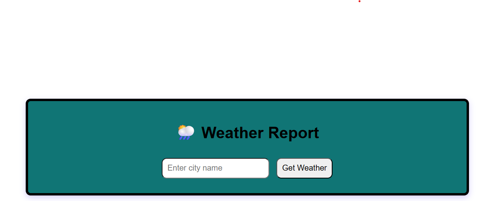

# 🌦️ Weather & Air Pollution Report

A simple and responsive web application that allows users to check the **current weather** and **air pollution (AQI)** for any city, district, state, or country in the world.

Built using **HTML, CSS, JavaScript**, and powered by the **OpenWeatherMap API**.

---

## 🚀 Features

- 🔍 Search weather and pollution data by typing any location
- 📍 Auto-detect coordinates using Geocoding API
- 🌡️ Displays temperature, humidity, wind speed, and weather condition
- 🌫️ Shows real-time Air Quality Index (AQI), PM2.5, PM10, and CO levels
- 📱 Fully responsive for mobile, tablet, and desktop
- ⚠️ Friendly error messages for invalid locations

---

## 📸 Screenshot


---

## 🧪 Tech Stack

- **Frontend:** HTML, CSS, JavaScript
- **API:** [OpenWeatherMap API](https://openweathermap.org/api)
  - Weather API
  - Geocoding API
  - Air Pollution API

---

## ⚙️ How It Works

1. User types a location (e.g., "Chennai", "Delhi", "Kallakurichi", "New York")
2. The app fetches latitude and longitude using OpenWeatherMap's **Geocoding API**
3. It then requests:
   - **Current weather** using `lat/lon`
   - **Air pollution data** using `lat/lon`
4. Results are shown in a clean UI

---

## 🛠️ Setup Instructions

1. Clone this repository:
   ```bash
   git clone https://github.com/your-username/weather-predictor.git
   cd weather-predictor

2. Open index.html in your browser.
3. Replace the default API key in structure.js:
   ```bash
   const apiKey = 'YOUR_API_KEY';
4. Get your free API key from [OpenWeatherMap](https://openweathermap.org/api)

## 🌐 Live Demo
  [Weather & Air Pollution Report](https://nisharj.github.io/Weather-and-Air-Pollution-Report/)
  
